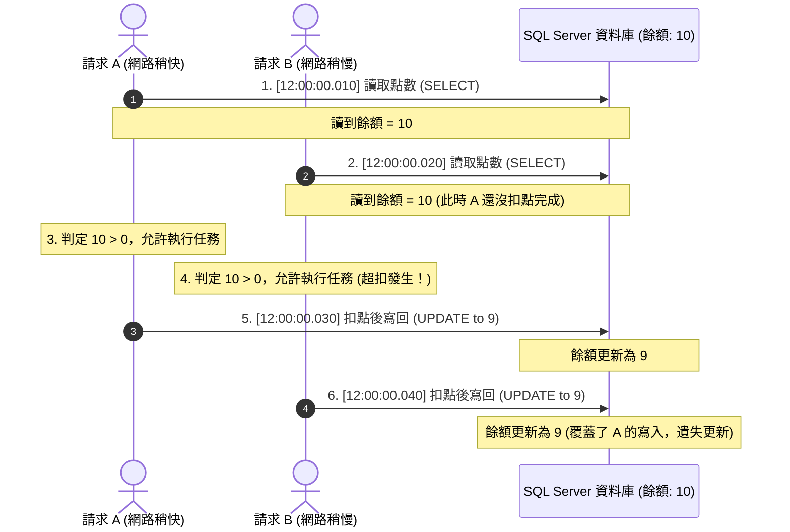

# 多執行緒資源競爭與原子更新防禦示範專案

這個專案旨在具體演示在高併發（High Concurrency）的環境下，多個執行緒同時存取共享資源時所產生的**資源競爭（Race Condition）**問題，並提供使用 SQL Server 原子更新（Atomic Update）進行防禦的正確做法。

---

## 為什麼網路有快有慢，依然會發生「超扣」？

有人可能會直覺認為：「**網路速度不會每次都一樣，Web 伺服器處理也有快有慢，請求會像排隊一樣有先後順序抵達，所以不可能同時發生資源競爭。**」

這是一個常見的誤區。資源競爭發生的條件**不需要絕對的「同時刻抵達」**，只需要**「處理時間在時間軸上有重疊（Overlapping）」**。

### 資源競爭（超扣）時間軸示意圖

假設初始點數為 `10`，有兩個請求 A 與 B 先後抵達（時間僅差 10 毫秒）：



### 關鍵原因分析
1. **讀取到舊資料**：即使請求 B 比請求 A 晚了 10 毫秒抵達，但只要 **A 還沒有把扣點後的結果寫回資料庫**，B 讀取到的就依然是舊的餘額（`10`）。
2. **遺失更新（Lost Update）**：兩者都以 `10 - 1 = 9` 的結果寫回資料庫，導致雖然**放行了 2 次任務，但資料庫實際上只扣了 1 點**，造成「帳目對不上」與「服務超給」的嚴重 Bug。

---

## 解決方案：資料庫原子更新（Atomic Update）

防禦資源競爭最簡單且高效的方法，是將「讀取、判斷、扣除」合併為單一的 SQL 原子操作：

```sql
UPDATE Members 
SET Points = Points - 1 
WHERE Id = 1 AND Points > 0;
```

* **原理**：利用資料庫內置的行級鎖（Row Lock）。當多個 UPDATE 同時進來時，SQL Server 會強制排隊，且每次更新都會檢查 `Points > 0` 條件。
* **驗證**：在程式中檢查該 SQL 影響的資料列數（Affected Rows）。若為 `1` 代表扣點成功；若為 `0` 代表點數已不足（被其他執行緒搶先扣完），拒絕執行任務。

---

## 專案結構

* **`src/ConcurrencyRaceConditionDemo.WebApi`**：提供測試的 Minimal API 端點。
  * `POST /api/points/reset?points=X`：重設點數。
  * `POST /api/points/deduct-unsafe`：不安全扣點（SELECT -> Delay 50ms -> UPDATE），模擬並重現超扣。
  * `POST /api/points/deduct-safe`：安全扣點（使用 EF Core `ExecuteUpdateAsync` 翻譯為原子更新 SQL）。
* **`src/ConcurrencyRaceConditionDemo.WinFormClient`**：WinForm 測試客戶端。可設定初始額度與併發請求數，並使用 `Task.WhenAll` 同時發送請求以觀察統計結果。
* **`verify_test.sh`**：自動化驗證腳本，可在非 Windows 環境下一鍵啟動 API 並發送高併發 `curl` 請求，直接驗證防禦效果。

---

## 快速開始

### 1. 啟動資料庫
本專案使用 Docker Compose 啟動 SQL Server：
```bash
docker compose up -d
```

### 2. 執行自動化驗證測試 (Linux/WSL)
專案根目錄下有自動化腳本，會自動編譯、啟動 Web API，並發送 50 個併發請求以呈現 Unsafe 與 Safe 的結果對比：
```bash
./verify_test.sh
```

### 3. 執行 WinForm 介面測試 (Windows)
您可以在 Windows 環境下使用 Visual Studio 或 `dotnet run` 啟動 `WinFormClient` 進行視覺化展示。
